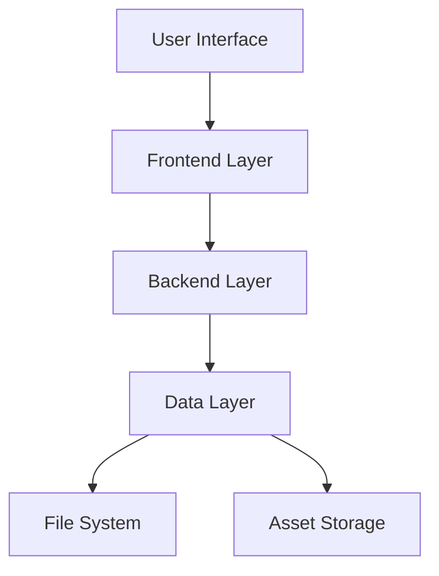

# Workwise - Job Search Platform
## Detailed Project Report

### Executive Summary
Workwise is a comprehensive job search platform designed to bridge the gap between job seekers and employers. This report provides a detailed analysis of the project's architecture, implementation, and operational capabilities.

---

## Table of Contents
1. [Project Overview](#project-overview)
2. [System Architecture](#system-architecture)
3. [Technical Implementation](#technical-implementation)
4. [User Interface Design](#user-interface-design)
5. [Functional Modules](#functional-modules)
6. [Operational Capabilities](#operational-capabilities)
7. [Testing and Quality Assurance](#testing-and-quality-assurance)
8. [Future Enhancements](#future-enhancements)
9. [Conclusion](#conclusion)

---

## Project Overview

### 1.1 Purpose and Scope
Workwise serves as a comprehensive job search platform that enables users to:
- Search for job opportunities across various industries
- Create and manage professional profiles
- Connect with potential employers
- Access career resources and guidance
- Apply for positions directly through the platform

### 1.2 Target Audience
- Job seekers (entry-level to experienced professionals)
- Employers and recruiters
- Career counselors
- Educational institutions

### 1.3 Project Goals
- Provide an intuitive and efficient job search experience
- Facilitate seamless communication between job seekers and employers
- Offer comprehensive career development resources
- Ensure platform accessibility and user-friendliness

---

## System Architecture

### 2.1 High-Level Architecture
The Workwise platform follows a modular architecture with the following components:

#### Frontend Layer
- HTML5 for structure
- CSS3 for styling
- JavaScript for interactivity
- Bootstrap 5.2.3 for responsive design

#### Backend Layer
- Node.js server
- HTTP request handling
- File system operations
- Data management

#### Data Layer
- Structured data storage
- File-based data management
- Asset management

### 2.2 Component Interaction

---

## Technical Implementation

### 3.1 Frontend Implementation

#### 3.1.1 HTML Structure
- Semantic HTML5 elements
- Responsive meta tags
- SEO optimization
- Accessibility compliance

#### 3.1.2 CSS Implementation
- Custom CSS framework
- Bootstrap integration
- Responsive design principles
- CSS animations and transitions
- Mobile-first approach

#### 3.1.3 JavaScript Functionality
- Event handling
- DOM manipulation
- Form validation
- Dynamic content loading
- Search functionality

### 3.2 Backend Implementation

#### 3.2.1 Server Configuration
- Node.js environment
- HTTP server setup
- Port configuration
- Error handling

#### 3.2.2 Routing System
- URL-based routing
- File serving
- Error page handling
- Request processing

#### 3.2.3 Data Management
- File system operations
- Data persistence
- Asset management
- Cache handling

---

## User Interface Design

### 4.1 Design Principles
- Clean and modern aesthetic
- Intuitive navigation
- Consistent branding
- Responsive design
- Accessibility compliance

### 4.2 Interface Components

#### 4.2.1 Navigation
- Header with logo
- Main navigation menu
- User authentication links
- Mobile-responsive menu

#### 4.2.2 Homepage
- Hero section with carousel
- Featured job listings
- Company highlights
- Search functionality

#### 4.2.3 Job Search Interface
- Advanced search filters
- Results display
- Job card design
- Pagination system

#### 4.2.4 Company Profiles
- Company information display
- Job listings
- Company statistics
- Contact information

### 4.3 Responsive Design Implementation
- Mobile-first approach
- Breakpoint management
- Flexible layouts
- Adaptive images
- Touch-friendly interfaces

---

## Functional Modules

### 5.1 Authentication Module
- User registration
- Login system
- Password recovery
- Profile management
- Session handling

### 5.2 Job Search Module
- Keyword search
- Advanced filtering
- Location-based search
- Industry filtering
- Experience level filtering

### 5.3 Company Module
- Company listings
- Company profiles
- Featured companies
- Company search
- Company ratings

### 5.4 Career Resources Module
- Career guidance
- Industry insights
- Professional development
- Job search tips
- Resume building

### 5.5 Contact Module
- Contact form
- Support system
- FAQ section
- Feedback system
- Help center

---

## Operational Capabilities

### 6.1 Core Functionalities
- Job search and filtering
- Company browsing
- User profile management
- Job application system
- Career resource access

### 6.2 Performance Metrics
- Page load times
- Search response time
- System uptime
- Error handling
- User engagement metrics

### 6.3 Security Features
- User authentication
- Data encryption
- Secure communication
- Input validation
- XSS prevention

### 6.4 Scalability
- Modular architecture
- Resource optimization
- Load handling
- Data management
- System expansion

---
## Conclusion

### 9.1 Project Achievement
- Successful implementation of core features
- User-friendly interface
- Efficient job search functionality
- Comprehensive company listings
- Career resource integration

### 9.2 Lessons Learned
- Technical challenges
- User feedback
- Implementation insights
- Best practices
- Areas for improvement

### 9.3 Recommendations
- Feature prioritization
- Technical improvements
- User experience enhancements
- Performance optimization
- Security measures

---

## Appendix

### A. Technical Specifications
- Development environment
- Tools and frameworks
- Dependencies
- Version control
- Deployment process

### B. User Documentation
- User guides
- API documentation
- Troubleshooting guides
- FAQ
- Support resources

### C. Project Timeline
- Development phases
- Milestones
- Deliverables
- Testing periods
- Launch schedule

---
